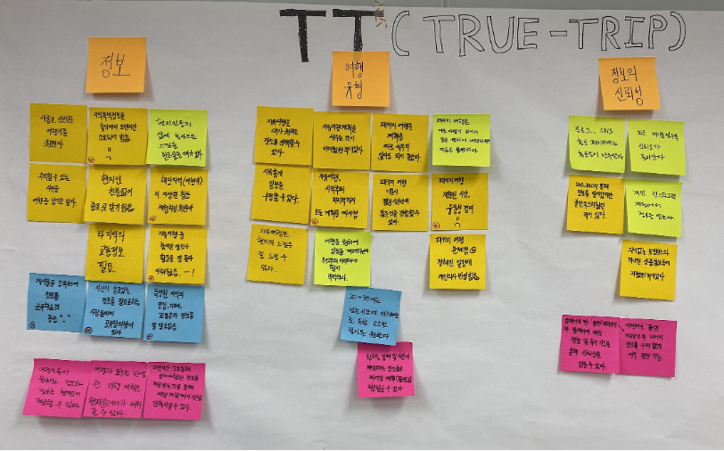
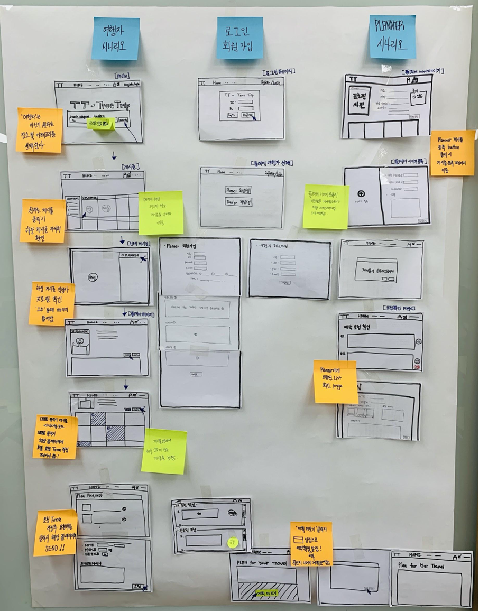
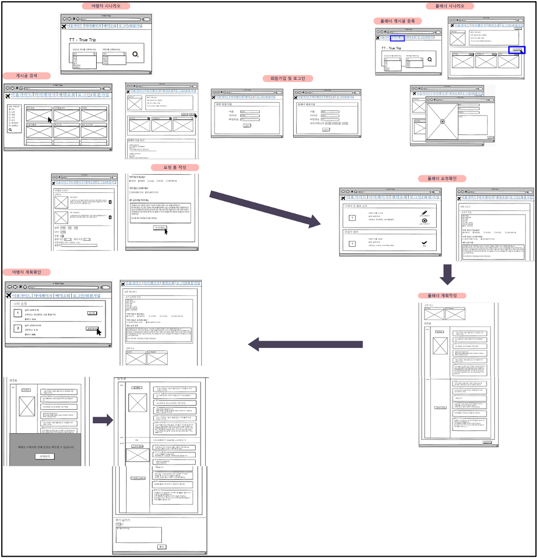
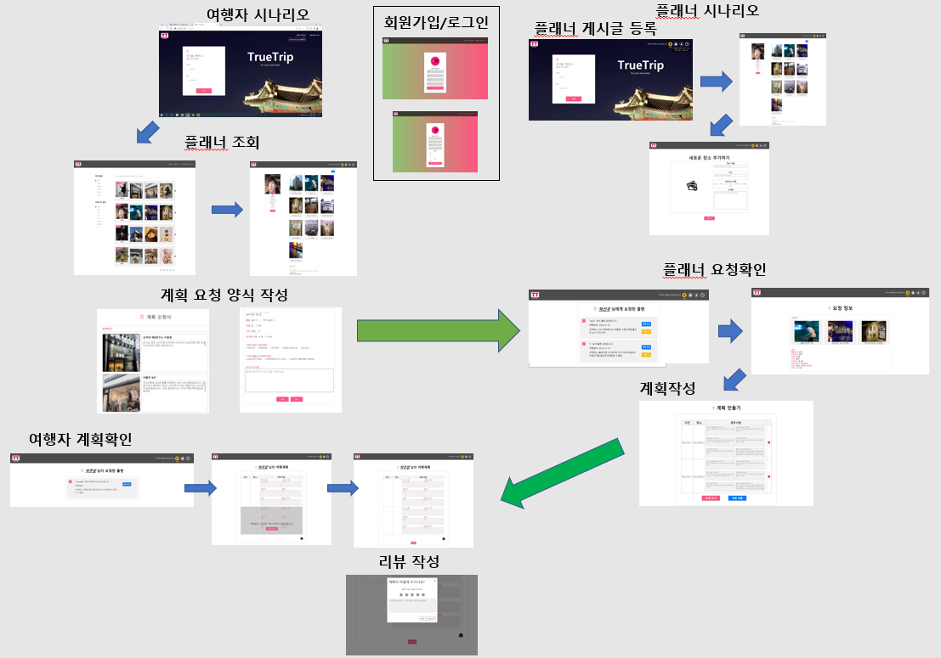
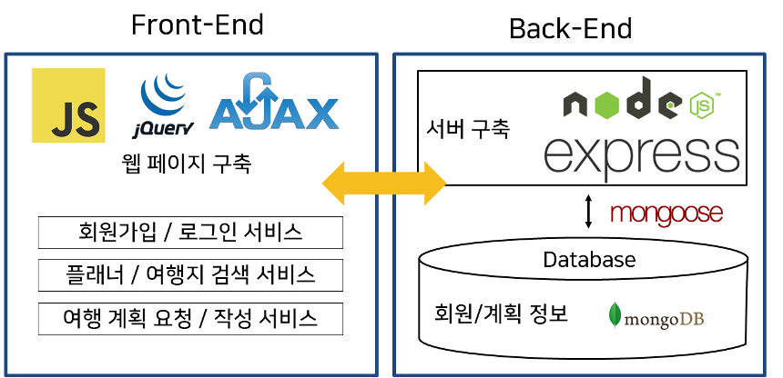

# TT--TrueTrip\_ HCI Project

---

### [프로젝트 소개]

##### 본 프로젝트는 HCI를 기반으로 진행한 프로젝트로서, 사용자의 needs를 중점으로 시스템을 설계하였다.

많은 이들은 휴가나 방학을 맞아 여행을 떠나곤 한다. 바쁜 일상을 살아가는 현대인들에게 정보를 수집해가며 자세한 여행계획을 세우는 것은 큰 스트레스로 다가올 수 있다. 물론 패키지 여행이라는 선택지가 있지만, 개개인의 의사가 잘 반영되지 않는다는 단점이 있다. 본 프로젝트에서는 이러한 패키지 여행과 자유 여행의 장점을 합쳐 여행객의 의사가 최대한 반영되면서도, 계획을 세우는 부담을 최소화하는 여행객- 플래너 서비스를 고안하게 되었다.

---

### [프로젝트 진행 방식]

#### 1. UX 방법론을 통한 설문조사 및 인터뷰

- 설문조사 및 인터뷰 방식
  설문조사는 아주대학교 학생 외 다수 85명 과 교환학생 10명을 대상으로 진행하였다. 인터뷰는 자유 여행 경험이 많은 학생 3명, 현지 정보를 공유하고 싶어하는 학생 1명을 대상으로 진행하였다. 설문조사와 인터뷰를 통해서는 여행자들이 여행을 하는 중 혹은 전후의 Needs를 판단할 수 있도록 하였다. 여행관심분야, 자유여행의 장단점, 패키지 여행의 장단점등으로 설문조사를 구성하였다. 특히 현지에 대해 잘 알고있는 사람에 대하여 인터뷰를 진행하였을 때에는 자신의 정보에 대해서 공유할 의향과 그 방식에 대해 중심적으로 인터뷰를 진행하였다.

- 설문조사 및 인터뷰 결과
  설문조사와 인터뷰를 통해서 여행자들의 의견을 크게 두 가지로 정리할 수 있었다. 첫번째는, 대부분의 사람들이 장소선택을 자신이 할 수 있다는 점에 있어 자유여행에 선호도가 높다는 것이었다. 다음으로는 자유여행에 대한 계획을 세우며 시간적인 면과 여행지에 대한 정보를 스스로 얻고 찾는 과정에 있어 많은 부담을 느끼는 것을 재확인할 수 있었다. 그 외에, 여행객들이 여행시에 어떠한 점들을 중요하게 생각하고, 관심을 두는 분야들을 파악할 수 있었다. 이를 통해 파악된 정보들을 통해 이후 여행자를 위한 카테고리를 구성하는 데에 사용하였다.
  현지정보에 대하여 많이 알고 있는 사람들을 대상으로 설문조사와 인터뷰를 진행하였을 때 이들은 ’현지 정보에 대하여 많이 알고 있고 이를 공유할 의사가 충분하다’는 의견을 얻을 수 있었다. 하지만 정보 공유방식에 있어서는 직접만나서 전달을 하기보다 인터넷을 통해 전달하고 싶다는 의견이 대다수였다.

#### 2. Affinity diagram

#### 3. Persona & Scenario

설문조사와 인터뷰, affinity diagram을 기반으로 Persona와 사용자 Scenario를 작성하였다.

#### 4. Prototype (Low-Fi, Mid-Fi, Hi-Fi)

- Low-Fi Prototype
  
- Mid-Fi Prototype
  
- Hi-Fi Prototype
  

#### 5. 구현

---

### 시스템 구조

---

### Authors

- [박선우](https://github.com/romaakk)
- [이시은](https://github.com/lee-sieun)
- [최진영](https://github.com/jinyoung0612)

---
